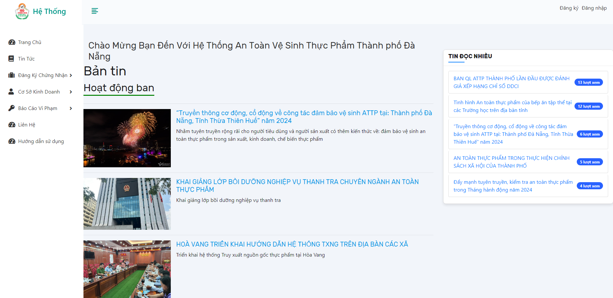
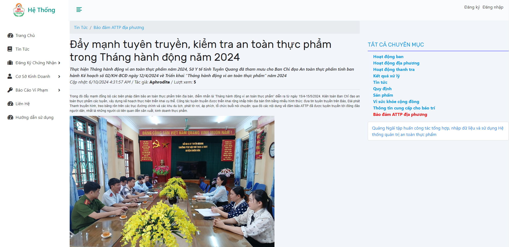
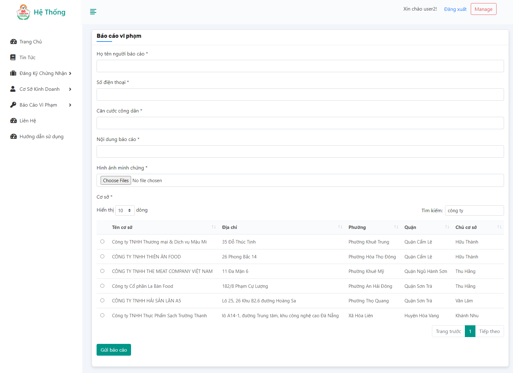
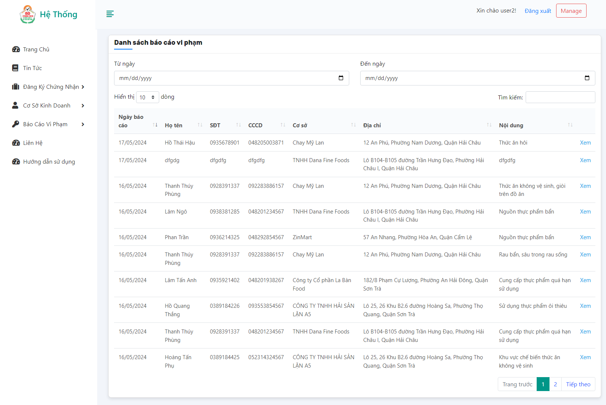
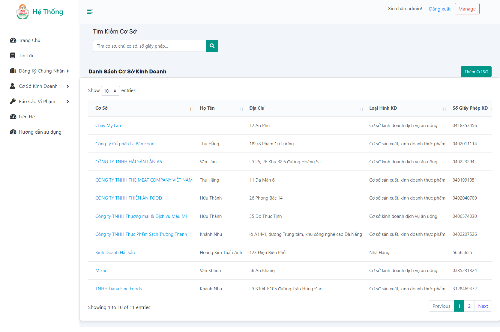
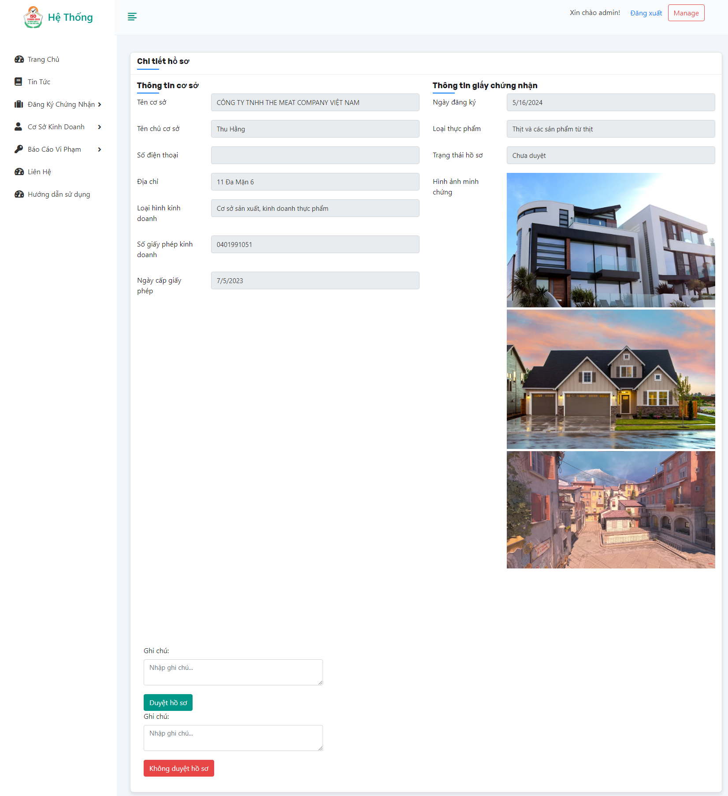
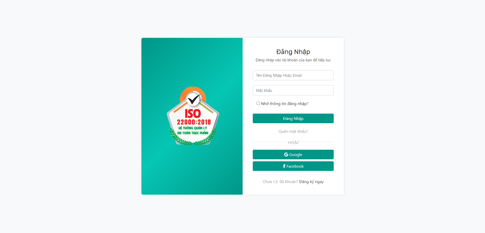

<h2>XÂY DỰNG HỆ THỐNG QUẢN LÝ VÀ THÔNG BÁO TÌNH TRẠNG AN TOÀN VỆ SINH THỰC PHẨM CHO THÀNH PHỐ ĐÀ NẴNG</h2>

<h3>Lớp	: 223DAPM2001   Nhóm	: 37</h3>

<table>
  <tr>
    <th>Họ tên</th>
    <th>MSV</th>
  </tr>
  <tr>
    <td>Hồ Gia Huy</td>
    <td>21115053120120</td>
  </tr>
  <tr>
    <td>Hồ Quang Nhật</td>
    <td>21115053120131</td>
  </tr>
  <tr>
    <td>Hoàng Chung Nghĩa</td>
    <td>21115053120129</td>
  </tr>
  <tr>
    <td>Hoàng Kim Tuấn Anh</td>
    <td>21115053120102</td>
  </tr>
</table>

---

